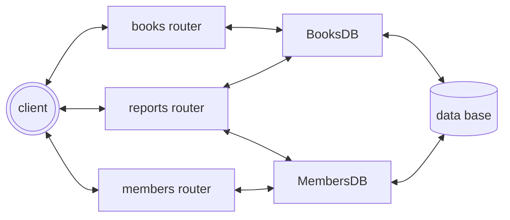

# מערכת של ספרייה, מקבלת/רושמת מנויים לספריה, נותנת לשאול ולהחזיר ספרים

### מבנה התקיות
```text
library-api/
│
│
├── main.py
├── database/
│   ├── db_connection.py
│   ├── book_db.py
│   └── member_db.py
├── routes/
│   ├── book_routes.py
│   ├── member_routes.py
│   └── report_routes.py
├── logs/
│   └── app.log
│
├── README.md
├── requirements.txt
└── .gitignore
```
### טבלת ספרים

| id | title | author | genre | is_available | borrowed_by_member_id |
|-|-|-| - | - | - |


### טבלת מנויים

| id | name | email | is_active | total_borrows |
|----|------|-------|-----------|---------------|

### חוקי המערכת
```
1
יצירת ספר
המשתמש שולח title/author/genre — המערכת מוסיפה is_available=True, borrowed_by=NULL
2
genre
חייב להיות Fiction / Non-Fiction / Science / History / Other — כל ערך אחר מחזיר שגיאה
יש לוודא הן בהוספה (POST) והן בעדכון (PATCH)
3
יצירת חבר
המשתמש שולח name/email — המערכת מוסיפה is_active=True, total_borrows=0
4
email
חייב להיות ייחודי — אם קיים כבר מחזיר שגיאה
5
חבר לא פעיל
אם is_active=False — אי אפשר להשאיל ספר
6
ספר לא זמין
אי אפשר להשאיל ספר שכבר מושאל (is_available=False)
7
מקסימום ספרים
חבר לא יכול להחזיק יותר מ-3 ספרים בו-זמנית
8
החזרת ספר
ניתן להחזיר ספר רק אם הוא מושאל לאותו חבר שמחזיר אותו
```

## Endpoints

### Books
| Method | Endpoint | תיאור |
| - | - | - |
| POST | /books | יצירת ספר |
| GET | /books | כל הספרים |
| GET | /books/{id} | ספר לפי ID |
| PATCH | /books/{id} | עדכון ספר |
| PATCH | /books/{id}/borrow/{member_id} | השאלת ספר לחבר |
| PATCH | /books/{id}/return/{member_id} | החזרת ספר מחבר |

### Members

| Method | Endpoint | תיאור |
| - | - | - |
| POST | /members | יצירת חבר |
| GET | /members | כל החברים |
| GET | /members/{id} | חבר לפי ID |
| PATCH | /members/{id} | עדכון חבר |
| PATCH | /members/{id}/deactivate | השבתת חבר |
| PATCH | /members/{id}/activate | הפעלת חבר |

### Reports

| Method | Endpoint | תיאור |
| - | - | - |
| GET | /reports/summary | דוח כללי |
| GET | /reports/books-by-genre | ספרים לפי ז'אנר |
| GET | /reports/top-member | החבר הכי פעיל |

### קוד הסקריפט לייצר קונטיינר דוקר חדש
```bash
docker run --name library_db \
  -e MYSQL_ROOT_PASSWORD= \
  -e MYSQL_DATABASE=library_db \
  -p 3306:3306 \
  -d mysql:latest ;
pip install -r requirements.txt
```


## הרצה
```bash
uvicorn main:app
```

